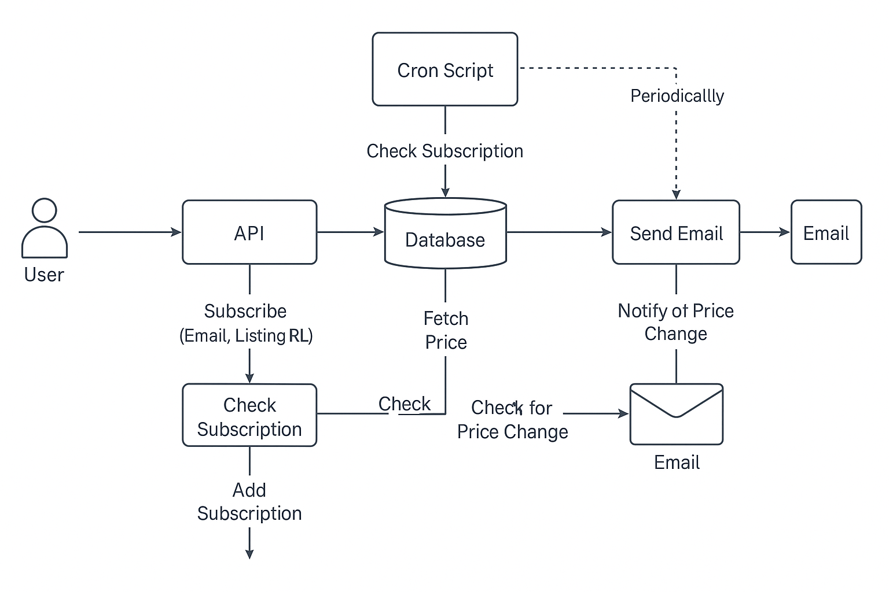

# Необхідно реалізувати сервіс, що дає змогу стежити за зміною ціни оголошення на OLX:

1. Сервіс повинен надати HTTP метод для підписки на зміну ціни. 
   На вхід метод отримує — посилання на оголошення, email, на який надсилати повідомлення.

2. Після успішної підписки, сервіс повинен стежити за ціною оголошення і надсилати повідомлення на вказаний email.
3. Якщо кілька користувачів підписалися на одне й те саме оголошення, сервіс не повинен зайвий раз перевіряти ціну оголошення.

## Результати роботи мають уключати:
## **- Схему/діаграму роботи сервісу та короткий його опис**
### Схема роботи сервісу:

#### Компоненти:
##### API:
Надає метод `api/subscribe` для підписки (отримує email та посилання на оголошення).
метод передає такі параметри:
`{
    "email": "example_email@gmail.com",
    "url": "https://www.olx.ua/d/uk/obyavlenie/neruhomst-budinok-IDXXmqz.html"
}`
##### Парсер:
Виймає ціну оголошення з сайту OLX.
##### База даних:
Зберігає користувачів, оголошення та передплати.
##### Cron-Скрипт:
Періодично перевіряє актуальність цін оголошень.
##### Mailer:
Надсилає повідомлення по email.
#### Потік даних:
Користувач надсилає запит на передплату (email + посилання на оголошення).
Система перевіряє, чи існує користувач та оголошення.
Якщо підписка ще не існує, створюється новий запис у базі даних.
Сервіс періодично запускає cron-скрипт, що перевіряє зміни ціни.
Коли ціна змінюється, надсилається повідомлення на email.

### Короткий опис роботи сервісу:
   Сервіс відстеження зміни ціни оголошень на OLX дозволяє користувачам підписуватись на відстеження змін ціни певних оголошень, отримуючи повідомлення на вказаний email при зміні ціни.
   #### Підписка: 
   Користувач підписується на відстеження зміни ціни через API, надавши email та посилання на оголошення.
   #### Відстеження: 
   Сервіс регулярно перевіряє ціну оголошення.
   #### Повідомлення: 
   Коли ціна змінюється, сервіс надсилає повідомлення на вказаний email.

## **- Посилання на репозиторій з кодом:**

## **- Підписка на зміну ціни:** 
   **реалізовано**
## **- Відстеження змін ціни:** 
   **реалізовано**
## **- Надсилання повідомлення на пошту:**
  **реалізовано**
## **- Мова програмування - PHP:** 
   **PHP 8.2**

**Якщо в ході завдання з'явилося декілька варіантів реалізації, то опишіть переваги й недоліки кожного з них. 
Укажіть, чому саме обрали той чи інший варіант.**

Насправді варіантів реалізації небагато.
## **Варіант 1:**
Реалізація на чистому PHP
### **Переваги:**
* **Мінімальні залежності:** Немає потреби в установці фреймворків або зовнішніх бібліотек. Це спрощує деплой, тому що не потрібно додаткового настроювання оточення.
* **Гнучкість:** Повний контроль над кодом та структурою програми, без необхідності дотримуватись суворих принципів фреймворків.
* **Продуктивність:** Можливість оптимізувати код під конкретні завдання, що може дати більшу продуктивність, особливо за невеликих обсягів даних.
* **Менше накладних витрат:** Немає додаткових шарів абстракції як у фреймворках, що дозволяє уникнути зайвого навантаження на сервер.
* ### **Недоліки:**
* **Підтримка та розширюваність:** Складність у подальшому масштабуванні або додаванні нових функцій без порушення архітектури.
* **Відсутність зручних інструментів та вбудованих рішень:** Наприклад, для маршрутизації, роботи з БД або обробки помилок потрібно писати код вручну.

## **Варіант 2:** 
Реалізація за допомогою фреймворку (наприклад, Laravel, Symfony і т.д.)
### **Переваги:**
* **Шаблони та архітектурні рішення:** Фреймворк пропонує готову структуру для розробки, що допомагає прискорити процес. Вбудовані рішення для маршрутизації, роботи з базою даних, автентифікації тощо. дозволяють уникнути написання коду, що повторюється.
* **Швидка розробка:** Існують готові компоненти, такі як системи сповіщень, системи тестування та інтеграції, що полегшує розробку.
* **Підтримка та масштабованість:** Фреймворки зазвичай мають багату документацію та широку підтримку спільноти, що полегшує підтримку та розширення програми.
* **Безпека:** Фреймворки надають вбудовані механізми захисту від SQL-ін'єкцій, XSS, CSRF та інших атак.

### **Недоліки:**
* **Додаткові залежності:** Потрібно встановити та налаштувати фреймворк, що може додати додаткові накладні витрати.
* **Продуктивність:** Хоча фреймворки оптимізовані для роботи з великими програмами, їх використання може бути надлишковим для простих завдань і призводити до додаткового навантаження на сервер.
* **Надмірність:** Багато фреймворків пропонують функціональність, яка може бути не використана в проекті, що збільшує складність та розмір програми.

Щоб отримати ціну оголошення, можна:

* **- парсити web-сторінку оголошення**
   реалізовано
* **- самостійно проаналізувати трафік на мобільних додатках або мобільному сайті й з'ясувати який там API для отримання 
інформації про оголошення**
У API OLX відсутні запити для контролю ціни конкретного оголошення.

# Ускладнення:
## **- Реалізувати повноцінний сервіс, який розв'язує поставлене завдання (сервіс має запускатися в docker-контейнері).**
   **реалізовано**
## **- Написані тести (постарайтеся досягти покриття в 70% і більше).**
   **реалізовано**
## **- Підтвердження email користувача.**
   **Реалізовано у функціоналі "Підписка на зміну ціни"**